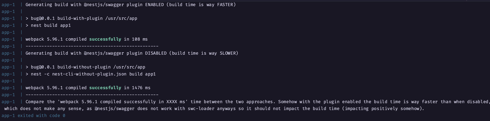

# NestJS bug reproduction

This repository is a reproduction of a weird behavior related to the building process of a NestJS application that uses webpack + swc-loader + @nestjs/swagger.

## Steps to reproduce

### Local
1. Clone this repository
2. Run `pnpm install`
3. Run `chmod +x ./entrypoint.sh`
4. Run `./entrypoint.sh`
5. Compare the build time with plugin enabled and plugin disabled

### Docker
1. Clone this repository
2. Run `pnpm docker:build`
3. Compare the build time with plugin enabled and plugin disabled

## Testing the application works fine

After building you can run the application normally with both build configurations.

```bash
pnpm build-with-plugin
pnpm start # Will start the application with the plugin enabled and everything works fine
```

```bash
pnpm build-without-plugin
pnpm start # Will start the application without the plugin enabled and everything works fine as well
```

## Expected behavior

Disabling or enabling the @nestjs/swagger should have no impact in the build time of the application, but the weirdest behavior is to have a build time 10x faster with the plugin ENABLED, which does not make any sense, since swc-loader does not even support the @nest/swagger plugin.

I'd like to see a faster build time without using the @nest/swagger plugin enabled - the only thing this plugin is doing for the project is to improve the build time, which shouldn't be happening.

## Screenshot

This screenshot was made using Docker, which ensures that is no caching going on as it will build the application from scratch.


